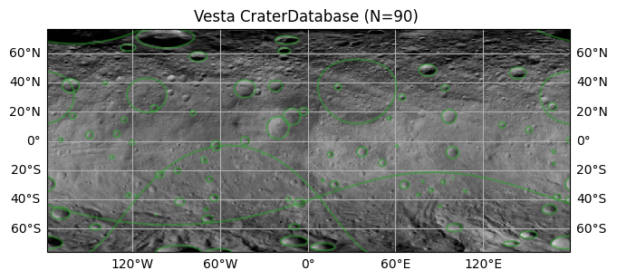

# Summary

`Craterpy` is an open-source Python package that reads impact crater databases, defines spatial regions of interest, and extracts data associated with each crater into standard Python data structures. It provides a simple and consistent toolkit for parsing, cleaning, and georeferencing crater data into Geopandas `GeoDataFrames`, and allows visualization and extraction of statistics from georeferenced raster imagery of planetary bodies across the Solar System (Figure 1). `Craterpy` simplifies many error-prone manual tasks like defining crater regions of interest in the correct projection, reprojecting to the format of the desired raster and handling pole-crossing or meridian-crossing geometries. `Craterpy` helps users access and analyze crater statistical data from lists of craters that can number in the millions from planetary images that can be GBs to TBs in size.  All of these features come from a clean and efficient object-oriented user interface, built to be interoperable with the planetary geospatial Python stack and Geographic Information System (GIS) software. 

Impact craters are ubiquitous across the Solar System. For every mission to a new planetary body and every enhancement of data resolution upon repeat visits, planetary scientists generate crater databases, typically in the form of tables of latitude, longitude, and diameter [@robbins2018;@herrick2018;@kirchoff2015;@zeilnhofer2021;@ghent2024;@robbins2012]. Crater and their ejecta, material excavated and deposited around them, reveal information about the age (chronology), layering (stratigraphy), and evolution of planetary surfaces and have been central to numerous planetary science investigations [@baby2024;@singer2025;@parekh2021;@asphaug1996;@li2018a;@venkatraman2023;@blewett2016;@elder2019]. For example, craters have been used to study the rate of physical and chemical alteration of the Moon's surface over time through data analysis of crater ejecta [@grier2001;@taiudovicic2021;@chertok2023;@nypaver2021a]. `Craterpy` provides a user-friendly toolkit to accurately and efficiently extract and process crater image data to facilitate and enable a wide range of planetary geological investigations. 

# Statement of need

Most crater data analysis tasks require common, repetitive tasks like the conversion of crater databases to precise regions of interest (ROIs) georeferenced to the planetary body of interest. This process can be time consuming and error-prone for non-specialists, particularly on large crater databases. In addition, planetary geospatial standards and formats are can be obscure with a steep learning curve and lack of documentation and tutorial materials relative to the burgeoning Earth-based open-source geospatial stack. 

 Analysis of crater data is becoming more computationally expensive as new missions return higher resolution data products in data volumes that now sometimes exceed TBs to PBs in size. Increases in data resolution also reveal exponentially more craters which may have previously been too small or outside the data coverage of previous missions. Recent crater databases can exceed 10$^6$ craters [@robbins2018;@wang2021] and are expected to grow by orders of magnitude with the rapid improvement of machine learning crater detection algorithms [@silburt2019;@delatte2019;@lagrassa2023]. Therefore, planetary scientists require an efficient set of tools to accurately and efficiently extract and process image data associated with craters and their surrounding ejecta. `Craterpy` has been used in two published research articles thus far [@taiudovicic2021;@chertok2023] and is presently in use by multiple NASA-funded planetary data analysis grants.

`Craterpy` makes crater data analysis simple and fast in Python. Extracting research image data from diverse datasets for a wide number a planetary bodies becomes tractable with a clean, consistent API, while publication quality plots are achievable in only a few lines of code. `Craterpy` is also built to be modular and interoperable with tools that planetary scientist users may already be familiar with. For instance, Craterpy is built on the popular `geopandas` library, and crater information can be easily exported to common GIS formats, such as GeoJSON, for use in mapping software like QGIS or ArcGIS. While these generalist mapping tools can accomplish many of the tasks that `Craterpy` provides, they can have steep learning curves and often struggle with converting between (non-Earth) planetary projections. `Craterpy` was designed to take crater data in formats commonly used by planetary scientists and deliver statistics that enable a wide range of inquiry into planetary geological processes across the Solar System. 

# Acknowledgements

This work was supported by NASA Discovery Data Analysis grant (80NSSC24K0065, PI: E.S. Costello).

We would like to thank our users and community for their invaluable feedback and contributions over the years.

# References